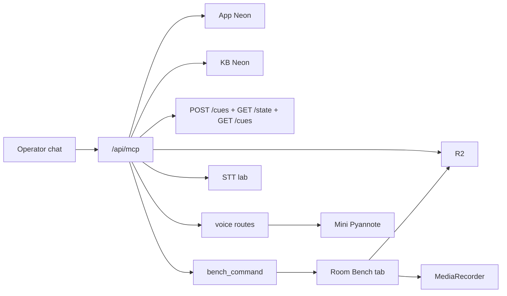

# Even Scribe — Operator MCP
## Product Requirements Document

| | |
|---|---|
| Status | Draft for the builder orchestrator |
| Date | 19 August 2026 (rev 3d — orchestrator + coder loop) |
| Author | Scribe Designer |
| Audience | Builder **orchestrator**. Not a ticket list for the coder. Pulse is a read-only neighbour. |
| Why now | We debug Scribe by signing a desktop into `/admin` and clicking. The product already has Pyannote, several STT engines, two Neons, R2, Bench, encounters, traces, and a new brain. The operator connector must reach **all of it**, including start/stop of a live Bench tape and cues that do not wait on the kiosk. |

This PRD is **the operator door**. It is not a new brain, not a new recorder, and not a chatbot.

---

## 1. One-line job

Expose Even Scribe to assistants as an MCP server with access everywhere, so an operator (this designer, from this chat) can act as a **second, more observant brain**: see more than the live fuse sees, notice when it is blind or wrong, inject evidence, drive the tape, and never silently replace Gemini-fast as the in-room state machine.

---

## 1a. Ship this on a branch. Do not touch today's Bench day.

19 Aug two-room capture (Purnima, Ankit) uses **current `main`** as already shipped: Start recording day, Pause, Mark consult, tape → R2. That UI stays byte-identical on production.

Build the Operator MCP on **`feat/operator-mcp`** (created 19 Aug off `main` @ `b907bc50`). Preview deploy is fine. **Do not merge. Do not run a new migration on production. Do not ship a `RoomRecorderClient` command poll to `www.evenscribe.app` until the clinic day is ended and the tapes are on R2.**

Why: the listener (1–2s poll + start/stop from MCP) is the first change that can fight a live kiosk. A `bench_command` migration on prod mid-day is the second. Everything else in this PRD can be developed in parallel without that risk, but we keep the whole door on one branch so a partial merge does not leak the poll.

After the day: merge only when Vinay says the tapes are safe. If a hotfix is needed for the live kiosk, it goes to `main` first; rebase the MCP branch.

---

## 1b. Who this is for (builder is two seats)

This PRD is **design + locks for the orchestrator**. It is not coder tickets and it is not a kickoff. The designer does not implement, does not launch coding agents, and does not open implementation PRs unless Vinay explicitly asks.

The builder is a team of two.

| Seat | Job |
|---|---|
| **Orchestrator** | Reads this PRD and the inventory. Knows the Scribe repo *and* the Pulse monorepo (read-only / fetch-only). Turns the locks into concrete coder instructions: files, routes, migrations, acceptance checks, what not to touch. Does not wait on the designer for a line-by-line patch list. |
| **Coder** | Builds what the orchestrator scoped, on `feat/operator-mcp`. Reports done / blocked back to the orchestrator. Does not merge. Does not treat this PRD as a ticket dump. |

### The loop

1. **Designer** (this chat) writes or revises the PRD + inventory. Design only.
2. **Orchestrator** reads `docs/operator-mcp/`. Uses the real trees — Scribe at `vinaybhardwaj-commits/Even-Transcription-Assistant`, Pulse at `code.evenhc.in` (fetch/pull allowed, **never push**) — to write coder instructions.
3. **Coder** builds on `feat/operator-mcp`. Preview deploy is fine. Production `main` / Room Bench stay the already-shipped kiosk.
4. **Coder → orchestrator** when a slice is done or blocked.
5. **Orchestrator → designer** (this chat). Designer reviews against the locks and §18. Next PRD rev if a lock was wrong or missing.

This loop is the intended one. It works.

### What the orchestrator must not do

- Re-open locked product decisions. Second fuse, Pulse writes, Slack writes, start-without-listener, silent `visit` UPDATE, warehouse auto-start — those are closed.
- Ask the designer for file-by-file edits. That is the orchestrator’s job, using the inventory and the two trees.
- Ship the kiosk command-bus poll, or run a new prod migration, while the 19 Aug clinic day is live.
- Write Pulse, post Slack, or put this door in the Pulse monorepo.

### What a coder brief from the orchestrator should contain

- The slice (e.g. “command bus + kiosk poll” or “GET cues + `scribe_post_cue`”).
- The real files to touch (from the inventory, not invented).
- The acceptance row(s) from §18 that close the slice.
- What is out of the slice (especially `RoomRecorderClient` on production, Pulse, Slack).
- How to prove it on the preview, not on `www.evenscribe.app`.

### What comes back to the designer

- What shipped on the branch (commit + preview URL).
- Which §18 rows pass / fail.
- Where the inventory was wrong (cite the real file).
- Open questions that need a **product lock**, not a code guess.

---

## 2. Problem

Scribe is three products on one host plus a Mini farm:

| Surface | What it is |
|---|---|
| Doctor PWA | PIN → record → multi-engine STT → note → email. Neon + R2. |
| Room Bench | All-day tape, pause, mark consult. R2 WebM. Mic lives in the room tab. |
| Brain | `POST /cues` + `GET /state`. Neon visit graph. No fuse yet. Intake is POST-only. |
| Mini tunnels | Pyannote (`DIARIZE_BASE_URL`), Whisper, IndicConformer, Ollama, Sarvam relay. |
| Cloud STT | Deepgram, Sarvam, ElevenLabs Scribe, EkaScribe (lab, some disabled). |
| Stores | App Neon, KB Neon (pgvector, read-only), R2 `eta-audio`. |

Today the only remote hands are Chrome on `/admin` and a bearer on two brain routes. `POST /api/bench/sessions` creates a row. It does **not** press the room mic. `POST /api/bench/brain-proxy` is kiosk-cookie gated and only accepts `live_sink_stats` + `consult_mark`. That is why “start recording from here” is currently a lie, and why an operator cannot send a cue unless the kiosk forwards it.

---

## 3. Goals

1. **Access everywhere.** Health, STT, Pyannote, both Neons, R2, Bench tape, encounters, traces, brain graph, cues. The connector is the operator’s hands, not a read-only peek.
2. **Remote tape control.** “Start recording in Purnima’s room” finds that room, talks to the Bench client that is listening, and starts the same MediaRecorder the kiosk button starts. Same for pause, resume, stop / end day. Consent-aware: do not start over an intentional Pause.
3. **Independent brain write.** The operator posts cues and information to the brain without going through the kiosk or `brain-proxy`. The ear and the operator are two sources.
4. **Extract by time.** “Give me 11:02–11:14 in room 1” returns that audio, not “here are three five-minute chunks, you figure it out.”
5. **Supervise, do not replace.** The Scribe brain remains the live fuse. This connector makes an operator *more observant* than that fuse (tape, STT, health, Pulse-shaped evidence, two rooms at once). It does not run a second visit graph that fights Gemini-fast.
6. **Notice without being asked.** Listener drop, brain-down, tape rolling with no cues, mark failed, chunk upload stuck, Pyannote down mid-day. Push those into the operator chat.
7. **Same objects the product already has.** Do not invent a second store. Wrap existing routes. Add a sibling only where a path is missing.
8. **Scoped auth, fail closed.** Admin-class token. Missing scope / unknown room / kiosk not listening → error, never a silent fake start.
9. **No Pulse writes. No Slack. No Gerrit.** No raw SQL. No raw R2 keys. Pulse/Metabase may be *read* as evidence and turned into cues.

---

## 4. Non-goals

- Replacing Bench, admin, the PWA, or `/admin/system-map`. The kiosk stays. The MCP drives it.
- A doctor-facing “Scribe GPT.”
- A second live fuse. The operator may pin or inject. It may not silently overwrite the visit graph.
- Streaming raw 250 ms audio through MCP.
- Writing Pulse / FreeScript / CDMSS.
- Hosting the MCP on a third-party box we do not already trust with this audio.
- Starting a tape when **no Bench tab is open** on the room machine. A native always-on room agent is a later product. v1 lock: the room page is up, signed in, and subscribed (see §8).
- Raw `SELECT` against Neon. Tools are typed.
- Reset PIN, create admin, rotate JWT secrets, run migrations from an assistant.
- Patient-identifying fields on kiosk-equivalent tools unless `include_identity=true`.

---

## 5. Constraints (standing)

- Pulse monorepo is read-only. Slack is read-only.
- Scribe repo owns this. Ship in `Even-Transcription-Assistant`.
- Host: same Vercel app (`www.evenscribe.app`). Path: `/api/mcp`.
- The MCP is an **internal client** of Scribe. It does not call Deepgram or Pyannote with its own keys.
- Mini services stay on the Mini. The MCP talks to them through Scribe.
- Consent / surveillance: start/stop and tape extract are as sensitive as standing in the room. Audit every tool call (who, tool, ids — never cue text, never audio).
- Visit is the **patient-day thread**. Tape is **per room**.
- Fail-open for the doctor: if the MCP or the command bus dies, the kiosk buttons still work. Pulse still works.

---

## 6. What already exists (do not re-litigate)

### 6.1 Stores

| Store | Env | Holds |
|---|---|---|
| App Neon (HTTP `neon()`) | `DATABASE_URL` / `APP_DATABASE_URL` | `clinician` (the `doctor` table is gone), encounters, `llm_traces` (admin traces UI) **and** older `trace` (per-stage), voice_print / voice_sample, stt_*, room, bench_session / bench_chunk / bench_event. Brain *tables* are created here by the app migrator. |
| Brain role (WS `Pool`) | `BRAIN_DATABASE_URL` | Runtime read/write of `room_day` / `visit` / `speaker_cluster` / `cue`. Same Neon, own role, needed for `BEGIN` + advisory lock. App role is not assumed to have grants. |
| KB Neon | `KB_DATABASE_URL` | read-only `mksap_chunks`. `GET /api/kb/probe` returns **text previews** (admin bearer), not just up/down. |
| R2 | `R2_*` bucket `eta-audio` | `encounters/`, `whisper-buffer/`, `voice-samples/`, Bench `bench/{slug}/{UTC-date}/{session_id}/chunk_*.webm`. The date folder is **UTC of session start**, not IST. No list-bucket API. |

Migrations through **0043**. Brain tables **0042**. No Redis. Timeline.md is **generated on GET**, not stored. IndexedDB `eta-bench` is kiosk-only and not remotely readable.

### 6.2 STT connections (live + lab)

| Engine | Where | Notes |
|---|---|---|
| Deepgram | Cloud, live WS token from Vercel | Browser talks to Deepgram directly after mint |
| Sarvam Saaras v3 | Cloud + optional Mini WS relay | Live = ≤30s REST windows |
| Whisper | Mini `POST /inference` | Rolling deltas via R2 buffer |
| IndicConformer | Mini `POST /inference` | Live box + lab; skips non-Indic |
| ElevenLabs Scribe | lab REST | |
| EkaScribe | lab, **disabled** (0026) | |
| `even_pipeline` | virtual | encounter’s own note |

Registry: `GET /api/admin/stt-lab/engines` (do not trust seed flags). `GET /api/health` probes **Whisper only** among STT. Full engine probe is STT-lab (admin cookie). Fanout is **encounter-shaped only** — cannot target a Bench chunk today.

**No STT on the Bench day path.** Live sink (`NEXT_PUBLIC_ETA_LIVE_SINK`, OFF) posts counters only. Replay runner is not in the repo.

### 6.3 Pyannote / voice

Mini only: `DIARIZE_BASE_URL` → `GET /health`, `POST /diarize`, `POST /enroll` (ECAPA 192). Vercel never calls Mini `/health`. Doctor identify is hardcoded **0.78** (phone path). Room/far-field must not use that number. `speaker_cluster` rows exist in schema; **nothing in `main` writes them yet**. `GET /state` only reads. One centroid family.

### 6.4 Brain

Live host is **this Vercel app** (`home: "vercel-app"`). `brain/` Cloud Run is not the door.

| Route | Auth | Notes |
|---|---|---|
| `POST /api/brain/cues` | `BRAIN_SERVICE_TOKEN` | intake. Open type set. No GET. No fuse. No visit writes. |
| `GET /api/brain/rooms/:id/state` | same | picture. Visits/clusters will usually be empty until something writes them. |
| `GET /api/brain/health` | open | always HTTP 200; `ok` is the truth |
| `POST /api/bench/brain-proxy` | **room cookie** | kiosk only. Producers today: `live_sink_stats`, `consult_mark`. Fail-silent. **Not** the operator path. |

**Missing:** `GET /api/brain/rooms/:id/cues`. Cue types *mentioned* in docs but with **no producer** in `main`: `stt_turn`, `speaker_match`, `pqm_called`, `dx_event`, `pulse_note`.

### 6.5 Bench today

Start / pause / resume / end live **in the browser**. `POST /api/bench/sessions` inserts a row; it does not press the mic. `GET /api/bench/sessions` is last 200, **no** room/date/status filters. `GET …/sessions/{id}` has **no** marks array (marks are SQL in the admin RSC + generated timeline). Live sink heartbeat is ≤1/min and is **not** a command channel.

---

## 6.6 Inventory locks (HEAD `b907bc50`, 19 Aug)

Checked against the public repo. The builder must not “fix” these by inventing a store that is not there.

1. Brain runtime is `BRAIN_DATABASE_URL` (WS). Timeline already uses that pool.
2. Admin `/admin/traces` reads `llm_traces`, not `trace`.
3. Identity table is `clinician`.
4. `.env.example` is stale (missing `BRAIN_*`, `GEMINI_*`, `NEXT_PUBLIC_ETA_LIVE_SINK`; cookie name wrong).
5. Open `/api/health` ≠ full topology. Compose it with `/api/brain/health` + STT-lab health + a **new** Pyannote probe.
6. Only two cue types are produced today. Operator/replay/warehouse types are new producers, not existing ones.
7. Bench list/detail need filters + marks before `scribe_list_sessions` / `scribe_get_session` are honest.
8. `scribe_run_stt_fanout` on a Bench chunk is new work (lab is encounter-only).
9. R2 Bench prefix date is UTC. Tools that take IST must convert before matching keys.
10. `GET /api/kb/probe` returns corpus text. MCP default is up/down only; hits only with `include_text=true`.
11. PWA identify 0.78 stays on the phone path. Room compare uses the far-field bar, not that constant.
12. No warehouse watcher, no fuse, no replay runner, no `/api/mcp` yet.

Full interface map: this folder, `SCRIBE-MCP-STACK-INVENTORY-19-AUG-2026.md`.


## 7. Product: what the MCP is

A remote MCP server the operator connects once. After that this chat can say:

- “Is Pyannote up?”
- “What cues just hit OPD Test?”
- “Start recording in Purnima’s room.”
- “Stop that tape.”
- “Extract 11:02–11:14.”
- “Send the brain a `consult_mark` / a warehouse cue / a test turn.”

One server. Three scopes. Seven domains. **Write is first-class**, not a later phase.

```
scribe:read     observe every domain
scribe:invoke   lab / replay / diarize / extract (costs CPU or paid STT)
scribe:write    start / stop / pause / mark / post cue
```

The operator token we use from here carries all three. Scopes exist so a narrower token can be minted later. They are not an excuse to ship a read-only door.

---

## 8. Remote tape — the Bench listener (new)

`POST /api/bench/sessions` cannot start a recording. The mic is in `RoomRecorderClient` on the room machine.

**Lock (Vinay, 19 Aug):** if we say start from here, and the system is up and listening for the MCP, it finds the room and starts. Same for stop.

That means the Bench page becomes an **MCP listener**, not only a button UI.

### 8.1 What “listening” means

The room tab is open, the room is signed in (`eta_room_session`), mic permission already granted or requested on the first remote start, and a command poll is running.

If the tab is closed, crashed, or on another room: `scribe_start_recording` returns **`kiosk_not_listening`**. It does **not** insert a `bench_session` and pretend. A row without a mic is the lie we are killing.

A native always-on room agent (no browser tab) is out of this PRD.

### 8.2 Command bus

Do **not** overload `brain-proxy`. That route is fail-silent, cookie-gated, and heartbeat-only.

New, small, durable bus:

| Piece | Job |
|---|---|
| Table `bench_command` | `id, room_id, kind, args, status (pending\|acked\|failed\|expired), source ('mcp'), created_at, acked_at, error` |
| `GET /api/bench/commands` | room-cookie. Returns pending commands for **this** room. Kiosk polls every **1–2 s** while the page is open (idle or recording). |
| MCP tools | insert a command, wait for ack (timeout ~8 s), return the kiosk’s result |

Kinds: `start_day`, `pause_day`, `resume_day`, `end_day`. Same verbs as the buttons. The client runs the existing start/pause/resume/end functions. It does not grow a second recorder.

On `start_day` the client: creates the session the way the button does, starts MediaRecorder, acks `{session_id}`. On `end_day`: stops the recorder, flushes the last chunk, PATCHes ended, acks.

Expiry: pending > 15 s without a poll → `expired`. The MCP tool then says `kiosk_not_listening`.

### 8.3 Finding the room

`scribe_start_recording` takes `room` as slug, name, or id (`opd-test-a7q9`, “OPD Test”, Purnima’s assigned room). Resolve uniquely. If two rooms match, error and list them. If the room has no recent command-poll (no listener), error. If two tabs on the same room are polling, the newest poll wins; the other is told `superseded` on next GET.

### 8.4 Visible on the kiosk

Remote start/stop must be as visible as a finger on the button. The listening chip already exists. Show “Started from operator” / “Stopped from operator” on the same chip. Do not hide remote control. Consent stays: Pause is still the off-switch, including when we started the tape.

---

## 9. Independent brain write (new)

The operator is a **first-class cue source**. It does not wait for the kiosk.

`scribe_post_cue` calls `POST /api/brain/cues` with `BRAIN_SERVICE_TOKEN` on the server. Body is the same `{ room_id, type, at?, payload? }`. Open type set. Payload may be a warehouse event, a consult_mark, an `stt_turn`, a test, or anything the brain already accepts.

Rules:

- **Not** via `brain-proxy`. That whitelist and room cookie stay for the kiosk.
- Does **not** require an active tape. We can cue a room that is silent.
- `consult_mark` from MCP still writes `bench_event` first when a session is active (same durable-first rule, `source: "mcp"`). If no session, the cue still lands on the brain and the tool says `no_active_session` for the event row — honest, not a 409 that blocks the cue.
- Operator cues are listable by `scribe_list_cues` like any other. Payload default is the 80-char summary.

This is how we debug “does the brain move if I tell it a patient sat down?” without walking to the room.

---

## 10. Extract audio by time (new)

Chunk index is not how an operator asks. They ask for a clock.

`scribe_extract_audio`:

| Arg | |
|---|---|
| `room` or `session_id` | required one of |
| `start` | IST clock or ISO |
| `end` | IST clock or ISO |
| `ist_date?` | when `room` + clock-of-day |

Server maps the range onto `bench_chunk` rows (started_at / ended_at). Then:

1. If the range sits inside one chunk → presigned GET of that WebM (and offsets in the result).
2. If it spans chunks → build a **clip** (server or Mini ffmpeg), park it on R2 under `bench/…/extract_{id}.webm`, return a short-lived presigned URL + duration.
3. If no chunks cover the range → `no_audio_in_range`.

Do not inline bytes in the MCP response. Do not make the operator stitch five-minute files.

`scribe_get_recording` (manifest / timeline / named chunk / day zip) stays for the archive view.

---

## 11. Operator brain — what else this door is for

Rev 1–2 made the hands. This section is the job those hands are for.

The Scribe brain is a live encounter-state estimator: who is in the room, which visits are open, which is in-chair / at diagnostics / ended. It is allowed to be unsure. Cues are infinite. It does not write the note.

The operator, through this MCP, is a **supervisor with better eyes**. Same clinic, more surfaces. Not a parallel state machine.

### 11.1 Jobs (include these)

| Job | Why | Tool / behaviour |
|---|---|---|
| **Watch** | A second brain that only answers when asked is a log viewer. | `scribe_watch_rooms`. Server-side predicates (below) POST a webhook into the operator chat or a standing routine polls every few minutes on clinic days. |
| **Diff picture vs tape** | The brain can say empty while chunks are landing. That is the bug we exist to see. | `scribe_diff_room`: graph + last cue + last chunk + listener + last mark, one object, contradiction flags. |
| **Hear the tape** | Bench day path has no STT yet. The operator should still hear a window. | `scribe_transcribe_range`: extract + one engine (default Whisper or Sarvam), return text. `invoke`. Not the live 250 ms ear. |
| **Replay a day** | Kickoff B was async replay of a finished tape through `/cues`. That is how we debug the fuse. | `scribe_replay_session`: walk a session’s chunks (or extracts) through STT + optional diarize + post `stt_turn` / cluster cues. Idempotent `replay_id`. Tagged `source: "replay"`. |
| **Pin / correct** | The fuse may be unsure. The operator may know. | `scribe_pin_visit`: `{room, at, visit_id? or individual_uid?, phase}` as a cue type `operator_pin`, never a silent UPDATE of `visit`. The fuse sees it as evidence. |
| **Warehouse / Pulse-shaped evidence** | The brain’s other eye is the warehouse. The operator can see Pulse/Metabase (read-only) and turn a consult-start or a saved note into a cue. | `scribe_post_cue` with types `warehouse_event`, `pulse_note`. No Pulse writes. No Scribe MCP talking to Gerrit. |
| **Cross-room visit** | Fluid consults: one patient-day, two rooms. | `scribe_get_visit(individual_uid, ist_date)` lists every `room_day` + cue window attached. v1 if the graph has the uid; otherwise return what we have and say so. |
| **Evidence trail** | “Why does the brain think this?” | `scribe_explain_state`: the cues in the window that the current picture is sitting on. Even before fuse: last N cues grouped by type. After fuse: the ones it cited. |
| **Day debrief** | Admin already has `timeline.md`. The operator should get that without Chrome, plus a contradiction appendix. | `scribe_day_report(room, ist_date)` = timeline + diff + marks vs chunks vs cues. |
| **Consent-aware start** | Pause is the off-switch. Remote start must not step on it. | `scribe_start_recording` fails with `room_paused` if the listener reports paused-for-consent, unless `override_pause=true` (audited, rare). |
| **Safe start** | Already recording → return the live `session_id`, do not start a second tape. | Idempotent start. |
| **Two-room snapshot** | Pilot is two rooms. | `scribe_watch_rooms` accepts many slugs. One payload. |

### 11.2 Watch predicates (push or poll)

Fire when any of these become true. Do not fire on every heartbeat.

1. A room that was listening stopped polling for >20 s while a session is `recording`.
2. Brain `/health` or `/cues` is 503.
3. Session is `recording` and no cue of any type for >5 min (tape without a picture).
4. `consult_mark` row stays `brain_status=failed`.
5. Newest chunk `upload_state` stuck `pending` >2 min.
6. Pyannote or Whisper probe flips from ok to down on a clinic weekday.
7. Listener reports `paused` for >30 min (maybe they forgot to resume).

Delivery: v1 = the operator’s standing routine polls `scribe_watch_rooms` on clinic mornings/afternoons. v1.1 = Scribe POSTs a signed webhook to a routine URL. Do not invent a Slack notify (Slack is read-only).

### 11.3 What the operator must not do

- Run its own visit graph and PATCH `visit` rows to “win.”
- Auto-start a room because a warehouse event arrived. Start is an explicit operator (or kiosk) verb. The warehouse is a cue, not a mic switch.
- Auto-resume over Pause.
- Flood `/cues` from a replay and a live ear at the same time on the same `room_day` without `source: "replay"` and a separate replay graph or a dry-run flag.
- Become the note/Rx writer. That pipeline still reads tape + graph later.

### 11.4 Source tags (required on every write)

Every cue and every `bench_event` from this door carries `source`: `mcp` | `replay` | `kiosk` | `warehouse`. Replay also carries `replay_id`. The fuse and `scribe_list_cues` can filter.

---

## 12. Tools by domain

Names are the contract.

### 11.1 Topology — `scribe:read`

| Tool | Returns |
|---|---|
| `scribe_health` | `/api/health` + brain health + STT-lab health + **Pyannote probe** + **Bench listeners** (`room_id`, last_poll_at, recording yes/no) |
| `scribe_system_map` | same picture as `/admin/system-map`. No secrets. |

`scribe_health.listeners` is how we know “start” will work before we call it.

### 11.2 Brain — read + write

| Tool | Scope | |
|---|---|---|
| `scribe_list_rooms` | read | id, slug, name, enabled. No PIN. |
| `scribe_get_state` | read | picture |
| `scribe_list_cues` | read | new GET. `since`, `type`, `limit`. Summary default. |
| `scribe_post_cue` | write | independent intake. §9. |

### 11.3 Bench tape — read + write + invoke

| Tool | Scope | |
|---|---|---|
| `scribe_list_sessions` | read | |
| `scribe_get_session` | read | chunks + marks |
| `scribe_get_recording` | read | presigned manifest / timeline / chunk / zip |
| `scribe_extract_audio` | invoke | time range → clip. §10. |
| `scribe_start_recording` | write | command bus `start_day`. Waits for ack. |
| `scribe_pause_recording` | write | `pause_day` |
| `scribe_resume_recording` | write | `resume_day` |
| `scribe_stop_recording` | write | `end_day` (flush last chunk, end session) |
| `scribe_mark_consult` | write | durable `bench_event` + brain cue, `source: "mcp"`. Does not need the kiosk. |
| `scribe_diff_room` | read | picture vs tape vs listener vs last cue. Contradiction flags. |
| `scribe_watch_rooms` | read | many rooms, one snapshot + which watch predicates are true. |
| `scribe_transcribe_range` | invoke | extract + STT. Hear the tape. |
| `scribe_replay_session` | invoke | finished tape → cues, `source: "replay"`. Dry-run default. |
| `scribe_pin_visit` | write | `operator_pin` cue. Does not UPDATE `visit`. |
| `scribe_explain_state` | read | evidence trail for the current picture. |
| `scribe_day_report` | read | timeline.md + diff + marks vs chunks vs cues. |
| `scribe_get_visit` | read | patient-day thread across rooms. |

Start/stop **require a listener**. Mark, post_cue, pin do not. Start is idempotent and fails on `room_paused` unless overridden.

### 11.4 STT — read / invoke

`scribe_list_stt_engines`, `scribe_stt_health`, `scribe_stt_routing`, `scribe_list_stt_runs`, `scribe_get_stt_run`, `scribe_run_stt_fanout` (encounter **or** a Bench chunk / extract).

Do not mint a Deepgram live token into this chat.

### 11.5 Voice / Pyannote — read / invoke

`scribe_voice_health`, `scribe_list_voiceprints`, `scribe_list_voice_samples`, `scribe_get_clusters`, `scribe_compare_voice`, `scribe_diarize_clip`.

Compare may take an extract from §10 as input. 0.78 stays banned as a published threshold.

### 11.6 Encounters / traces / stores — read

`scribe_list_encounters`, `scribe_get_encounter`, `scribe_list_traces`, `scribe_get_trace`, `scribe_store_stats`, `scribe_kb_probe`.

No `scribe_sql`.

---

## 13. Topology



Brain writes from the operator **do not** go kiosk → `brain-proxy` → brain. They go MCP → `/api/brain/cues`.

---

## 14. Phases

Purnima / Ankit capture today does **not** wait on this. The listener is how we drive those rooms from here afterwards.

### v1 — Door + listener + independent cues + supervisor eyes

Ship:

- All `scribe:read` tools including `scribe_diff_room`, `scribe_watch_rooms`, `scribe_explain_state`, `scribe_day_report`
- `GET /api/brain/rooms/:id/cues`
- Command bus + kiosk poll + start / pause / resume / stop (consent-aware, idempotent)
- `scribe_post_cue`, `scribe_mark_consult`, `scribe_pin_visit` (MCP source)
- `scribe_extract_audio` (single-chunk range first)
- `scribe_transcribe_range` on that extract (one engine)

Demo from this chat:

1. Health shows OPD Test **listening**.
2. `scribe_start_recording(opd-test-a7q9)` → kiosk chip changes, session id returns, first chunk lands.
3. `scribe_post_cue` a `consult_mark` → `scribe_list_cues` shows it without anyone tapping the kiosk.
4. `scribe_extract_audio` for the last two minutes returns a presigned clip.
5. `scribe_stop_recording` → session ended, last chunk flushed.
6. Start with the tab closed → `kiosk_not_listening`, no orphan session row.

### v1.1 — Replay, hear, warehouse-shaped cues

`scribe_replay_session` (dry-run then live), multi-chunk extract, fanout, compare voice, diarize, `scribe_get_visit`, watch webhook. Warehouse/Pulse events still enter as cues the operator posts (or a later watcher posts). The operator does not write Pulse.

---

## 15. Auth

- Remote MCP on the Scribe deployment.
- `SCRIBE_MCP_TOKEN`, constant-time. Not doctor JWT, not room cookie, not admin password.
- The token we connect from here has read + invoke + write.
- Connect via the connector card. Never paste the token into chat.
- Audit: `at, token_id, tool, args_safe`.
- Brain stays on `BRAIN_SERVICE_TOKEN`. The MCP is a client. The kiosk never sees either token.
- Command GET is room-cookie only. Command insert is MCP-token only.

---

## 16. Privacy

Start/stop and extract are clinic audio.

- Default list/get responses are summaries and pointers.
- `include_payload` / `include_text` / `include_prompts` / `day_zip` / `include_identity` are explicit.
- Extract URLs expire short (minutes, same family as admin presign).
- Retention unchanged.
- Never echo PIN, JWT, R2 secret, provider keys.

---

## 17. Shape in the repo

```
app/api/mcp/route.ts
lib/mcp/auth.ts
lib/mcp/tools/{health,brain,bench,stt,voice,encounters,stores}.ts
app/api/brain/rooms/[id]/cues/route.ts
app/api/bench/commands/route.ts          # GET (room cookie) + not used by MCP
db/migrations/0044_bench_command.sql
components/room/RoomRecorderClient.tsx  # 1–2s poll, run existing start/stop
```

Add Pyannote **and** listener last-poll to `GET /api/health` (or a sibling the health tool also calls).

Do not put this in the Pulse monorepo. Do not put the MCP on the Mini. Extract ffmpeg may run on the Mini; the door stays on Vercel.

---

## 18. Acceptance (v1)

From this assistant, after one connect, no Chrome:

- Health names Neon app, Neon KB, R2, Whisper, Pyannote, brain, each STT engine, and which rooms are **listening**.
- Rooms include `opd-test-a7q9`.
- Sessions include `bs_zcfegzwn` and `bs_m6jajk8d`.
- Cues for a room-day are listable.
- State returns the picture.
- An operator cue appears in `scribe_list_cues` without a kiosk tap.
- Start on a listening room creates a real tape (chunk 0 on R2). Start on a dark room fails clean.
- Stop ends that session and flushes.
- Extract of a two-minute window returns a presigned clip (or one covering chunk + offsets).
- `scribe_diff_room` on a recording-but-silent-brain room flags `tape_without_cues`.
- `scribe_transcribe_range` returns text for that window.
- Start while paused-for-consent returns `room_paused`.
- Start while already recording returns the live session, no second tape.
- `scribe_pin_visit` shows up as a cue, `visit` row unchanged.
- Replay dry-run posts nothing.
- Token missing → 401. Write without scope → 403.
- No Pulse call. No Slack post. No cue text in the audit log.

---

## 19. Open questions

1. Per-operator tokens vs one full-access token (v1 can be one).
2. Multi-chunk extract on Vercel vs Mini ffmpeg. Prefer Mini if the clip can be tens of minutes.
3. Cross-room `scribe_get_visit(individual_uid, ist_date)` when fluid consults land.
4. Whether a second tab in the same room is an error or last-poll-wins (default last-poll-wins).
5. Watch delivery: standing routine poll vs signed webhook first. Default poll, because Slack cannot be the bell.
6. Replay: separate scratch graph vs `source:replay` on the live `room_day`. Default dry-run + scratch until we have seen one real day.

Closed by this rev: start-from-here is in; pause/end from here are in; brain write does not wait on the kiosk; the operator is a supervisor, not a second fuse.

---

## 20. Glossary

| Term | Meaning |
|---|---|
| Operator MCP | This PRD. The door. |
| Orchestrator | Builder seat that turns this PRD into coder instructions. Reports back here. |
| Coder | Builder seat that implements on `feat/operator-mcp`. Reports to the orchestrator. |
| Listener | Room Bench tab, signed in, polling `bench_command` |
| Command bus | Durable start/stop/pause/resume queue. Not brain-proxy. |
| Independent cue | MCP → `/api/brain/cues`. No kiosk. |
| Extract | Time-range clip off the tape |
| Operator brain | This assistant, via the MCP: supervisor, not a second fuse |
| Watch | Predicates that fire without a human asking |
| Diff | Picture vs tape vs listener vs last cue |
| Pin | `operator_pin` cue. Evidence, not a row overwrite. |
| Replay | Finished tape walked back through `/cues`, tagged |
| Picture | `GET /state` visit graph |
| Tape | R2 Bench archive |

---

## 21. References

- Live: https://www.evenscribe.app
- Repo: `vinaybhardwaj-commits/Even-Transcription-Assistant`
- Brain PRD: `EVEN-SCRIBE-AMBIENT-BRAIN-PRD.md`
- Identity: `SCRIBE-BRAIN-IDENTITY-PYANNOTE-18-AUG-2026.md`
- Mark brief: `SCRIBE-BENCH-CONSULT-MARK-BUILDER-BRIEF-18-AUG-2026.md`
- Pilot addendum: `SCRIBE-POC-PILOT-ADDENDUM-18-AUG-2026.md`
- Far-field tape: `bs_zcfegzwn`
- Stack inventory (HEAD `b907bc50`): `SCRIBE-MCP-STACK-INVENTORY-19-AUG-2026.md`
- Draft PR (docs only, do not merge): https://github.com/vinaybhardwaj-commits/Even-Transcription-Assistant/pull/1
- Builder note (start here): `docs/operator-mcp/README.md`
