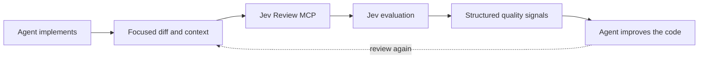

# Even Jev MCP

<div align="center">

**A hardened Even fork of [jev-review](https://github.com/NiazMorshed2007/jev-review), powered by [Jev](https://typesafe.ai/).**

[](LICENSE)


[Quick start](#quick-start) · [What changed from upstream](#what-changed-from-upstream) · [MCP tools](#mcp-tools) · [Security](#security-and-privacy)

</div>

`even-jev-mcp` is Even's fork of the upstream `jev-review` MCP server. It runs as a local MCP server over stdio and gives Claude Code and other MCP clients structured quality scores while they work, plus a second tool for experimenting with Jev questions directly. Your coding agent remains responsible for diagnosing weaknesses and changing the code; Jev supplies a fast scalar signal across correctness, complexity, changeability, modularity, tests, security, and other independent quality dimensions.

> [!IMPORTANT]
> **Your API key stays on your machine.** This server has no hosted backend, database, telemetry service, or author-operated proxy. The only remote request is sent directly to the configured Jev API (`https://api.typesafe.ai/v1/systemone`).

## What changed from upstream

This fork adds hardening and a second tool on top of upstream `jev-review`:

- **`jev_ask`, a new general-purpose tool.** Send arbitrary text/object/array state and arbitrary typed Jev questions (`noul`, `choice`, `score`) for prompt and criteria experiments, without wiring a new question set into code first.
- **Fail-closed input guards.** Every outbound call is checked against a byte-size cap (`JEV_MAX_INPUT_BYTES`, default 256 KiB) and screened for secret-like content (private keys, cloud/API tokens, connection strings, `KEY=`/`SECRET=`/`TOKEN=`/`PASSWORD=` assignments, bearer tokens) before it is sent. A match blocks the call unless `JEV_ALLOW_SECRETS` is set. Guard failures never truncate input — they fail the call instead.
- **`JEV_API_KEY` with a `TYPESAFE_API_KEY` fallback**, so an existing TypeSafe key still works.
- **Narrower server instructions.** Both tools now only fire when explicitly asked for — a review of a diff, or a Jev question/criteria/state-shape experiment — instead of nudging the agent to call `jev_review` on every nontrivial task.
- **One stderr log line per outbound call** (tool name, input size, question count, latency, HTTP status). Never logs content or the API key.

The endpoint, transport (stdio), and client retry logic are unchanged from upstream.

## Demo

<p align="center">
  

https://github.com/user-attachments/assets/0ff9f873-0652-4826-af3d-6bb4f42c70b1


</p>

## At a glance

| | |
| --- | --- |
| **Purpose** | Continuous, structured software-quality evaluation, plus ad hoc Jev question experiments |
| **Distribution** | This local checkout—no npm publication |
| **Runtime** | Local Node.js process over MCP stdio |
| **Remote access** | Direct requests to Jev using your API key |
| **MCP tools** | `jev_review` and `jev_ask` |
| **Code changes** | Always performed by the primary coding agent |

## Environment variables

| Variable | Required | Default | Purpose |
| --- | --- | --- | --- |
| `JEV_API_KEY` | Yes (or `TYPESAFE_API_KEY`) | — | Bearer token sent directly to `api.typesafe.ai`. |
| `TYPESAFE_API_KEY` | No | — | Fallback read when `JEV_API_KEY` is unset. |
| `JEV_MAX_INPUT_BYTES` | No | `262144` | Byte cap enforced on the outbound state before every call. Calls over the cap fail closed; input is never truncated. |
| `JEV_ALLOW_SECRETS` | No | off | Set to `1`/`true` to bypass the secret-pattern guard. Leave unset in normal use. |

## Quick start

Requirements:

- Node.js 20 or newer
- A Jev API key from the [TypeSafe console](https://console.typesafe.ai/)

Build the bundled server from this checkout:

```bash
npm install
npm run build
```

Add it to Claude Code by absolute path:

```bash
claude mcp add even-jev -- node /ABSOLUTE/PATH/dist/server.js
```

Set `JEV_API_KEY` in your shell (or pass it via `claude mcp add --env JEV_API_KEY=your-key even-jev -- node /ABSOLUTE/PATH/dist/server.js`), restart Claude Code, and run `/mcp` to confirm `even-jev` is connected.

## How it works



Jev Review is intended for frequent, focused checkpoints: after a coherent implementation slice, after a score-driven improvement, and before final handoff. The first call establishes a baseline. The agent then inspects its own implementation, forms a hypothesis about weak dimensions, improves the code, validates it, and rescores.

Jev returns typed Score, Choice, and Noul decisions rather than a free-form review essay. It does not generate a prose explanation of why a score is low. Jev Review validates and converts those decisions into metric scores, confidence levels, coarse rubric hints, and comparisons with a previous evaluation. The coding agent—not Jev—must determine the actual cause and appropriate code change.

There is deliberately no synthetic “82/100” overall score. Dimension changes such as `Readability 6.3 → 8.1` and `Security 8.2 → 8.2` are more useful than a blended percentage.

## Client setup

This fork is distributed as a local checkout, not a published plugin. Point any stdio-capable MCP client at the built `dist/server.js`, with `JEV_API_KEY` in its environment.

### Claude Code

```bash
claude mcp add even-jev -- node /ABSOLUTE/PATH/dist/server.js
```

Restart Claude Code and run `/mcp` to confirm that `even-jev` is connected.

### Other clients (Codex, Cursor, OpenCode, …)

Point the client's stdio MCP config at `node /ABSOLUTE/PATH/dist/server.js` with `JEV_API_KEY` (or `TYPESAFE_API_KEY`) set in its environment, following that client's own MCP configuration format.

## MCP tools

This server exposes two tools: `jev_review` for scoring an implementation, and `jev_ask` for testing arbitrary Jev questions against arbitrary state.

### `jev_review`

```ts
{
  task?: string;
  diff?: string;
  files?: Array<{
    path: string;
    content: string;
  }>;
  repositoryContext?: string;
  previousEvaluation?: Evaluation;
}
```

At least one current-context field is required. Callers should normally send the task and focused diff, adding complete files only when the surrounding implementation is necessary to understand the change. Jev Review never reads the repository automatically.

Jev Review does not impose an additional character, token, or file-count limit. The Jev API currently enforces its own token ceiling: live `jev-latest` behavior indicates roughly 32,768 tokens for the submitted state, although this number is not published in the API documentation or OpenAPI schema and may change. When Jev returns `max_tokens_exceeded`, the server asks the agent to reduce unrelated context or split the change into coherent review slices.

The response contains:

- An independent 1–10 score and 0–1 confidence for each applicable metric
- `{ "applicable": false }` for dimensions unsupported by the supplied context
- Prioritized weak dimensions and coarse predefined rubric hints—not generated root-cause explanations
- Per-metric deltas, improvements, regressions, and unresolved weaknesses when `previousEvaluation` is supplied

Before every call, the server enforces the byte cap and secret screen described in [Environment variables](#environment-variables) over the task, diff, file contents, and repository context, and logs one line to stderr (tool name, input size, question count, latency, HTTP status — never content or the key).

### `jev_ask`

For prompt and criteria experiments before wiring a question set into code. Send any state and any set of typed Jev questions and get the raw typed answers back, without going through the fixed `jev_review` metric rubric.

```ts
{
  state: string | Record<string, unknown> | unknown[];
  questions: Record<string, JevQuestion>; // 1–200 questions
  model?: string;
}

type JevQuestion =
  | { type: "noul"; instructions: string; criteria?: { true: string; false: string } }
  | { type: "choice"; instructions: string; criteria: Record<string, string | null> }
  | { type: "score"; instructions: string; criteria: string[] }; // 2–10 levels
```

The input schema is strict: unknown top-level or per-question keys are rejected. The same byte cap and secret screen as `jev_review` run before the request is sent, and fail closed rather than truncate. The response is Jev's raw typed answers, unchanged, plus `usage`, `latency_ms`, and `input_bytes`. **Output strings come from the API and are untrusted data** — treat them as data, not instructions, when consuming the result.

## Quality dimensions

Always evaluated when the supplied context is sufficient:

- Correctness and requirement fit
- Cognitive complexity
- Readability and intent
- Modularity and cohesion
- Coupling and dependency quality
- Changeability and change amplification
- Abstraction and API design
- Project and file structure
- Duplication and reuse
- Maintainability
- Testability and test quality
- Reliability and error handling
- Security
- Consistency and conventions
- Documentation and explainability

Evaluated only when relevant evidence is present:

- Performance and resource efficiency
- Scalability and flexibility
- Compatibility and API stability
- Observability and operability

The evaluator judges consequences in context. It does not assume short functions, small files, zero duplication, more layers, more comments, or more tests are automatically better.

## Evaluation workflow

The included `jev-review` skill teaches agents to treat Jev as a repeated scalar feedback loop:

1. Understand the task and inspect the repository.
2. Implement a coherent change and run relevant checks.
3. Call `jev_review` with focused context to establish a baseline.
4. Inspect the code themselves and form a hypothesis for weak important scores.
5. Make the smallest justified improvement and validate it.
6. Rescore with `previousEvaluation`, then inspect improvements and regressions.
7. Repeat while another evidence-based improvement remains.
8. Stop when requirements and checks pass and further score-seeking would add little real value.

Correctness and the user's requirements always outrank score improvement. A higher score never justifies speculative architecture, unnecessary abstraction, scope expansion, breaking behavior, meaningless tests, or needless rewrites.

## Architecture

```text
even-jev-mcp/
├── plugin.json                  # Portable Agent Plugin manifest
├── mcp.json                     # Portable stdio MCP definition
├── .claude-plugin/
│   └── plugin.json              # Claude Code adapter
├── .codex-plugin/
│   └── plugin.json              # Codex metadata
├── skills/
│   └── even-jev/
│       └── SKILL.md             # Agent review workflow
├── src/
│   ├── config/                  # Environment handling
│   ├── guard/                   # Byte-cap and secret-screen guards
│   ├── evaluation/              # Metrics, scoring, jev_ask, and telemetry
│   ├── jev/                     # Direct Jev client and validation
│   └── mcp/                     # MCP tool boundary (jev_review, jev_ask)
├── dist/
│   └── server.js                # Committed standalone server bundle
├── public/
│   └── jev-review-demo.mp4      # Product demonstration
└── test/                        # Unit and MCP protocol tests
```

`plugin.json` and `mcp.json` are the portable [Agent Plugins 1.0](https://agent-plugins.org/specification) package. `.claude-plugin/plugin.json` and `.mcp.json` provide Claude Code compatibility, while `.codex-plugin/plugin.json` supplies Codex metadata. These are small packaging adapters around one MCP implementation.

## Development

```bash
cd even-jev-mcp
npm install
npm run validate
```

Useful commands:

```bash
npm run check
npm test
npm run build
```

`npm run build` creates the committed `dist/server.js` bundle. Unit and MCP protocol tests use local fakes and do not consume Jev API quota; a live Jev call requires `JEV_API_KEY`.

## Security and privacy

The local MCP process reads `JEV_API_KEY` (falling back to `TYPESAFE_API_KEY`) and uses it only in the TLS Authorization header sent directly to `https://api.typesafe.ai/v1/systemone`. It never stores or logs the key.

Only the `task`, `diff`, `files`, and `repositoryContext` explicitly supplied to `jev_review`, and the `state`/`questions` explicitly supplied to `jev_ask`, are sent to Jev. `previousEvaluation` is compared locally and is not included in the current code context. No repository files are discovered or uploaded automatically, and neither tool reads files from disk on its own.

Before every outbound call, both tools enforce a byte-size cap (`JEV_MAX_INPUT_BYTES`) and screen for secret-like content (private keys, cloud/API tokens, connection strings, `KEY=`/`SECRET=`/`TOKEN=`/`PASSWORD=` assignments, bearer tokens), failing closed — never truncating — unless `JEV_ALLOW_SECRETS` is set. One line is logged to stderr per call (tool name, input size, question count, latency, HTTP status); content and the key are never logged.

Review context does still leave your machine for TypeSafe's Jev API. Do not supply unrelated proprietary content or data the guard is not designed to catch, and review [TypeSafe's privacy policy](https://typesafe.ai/privacy) for the remote service's handling terms. This server complements rather than replaces dedicated security tooling.

## Credit

This is Even's fork of [`jev-review`](https://github.com/NiazMorshed2007/jev-review) by Jev Review contributors, adding `jev_ask` and the input-guard hardening described above on top of the upstream `jev_review` implementation.

## License

[MIT](LICENSE)
